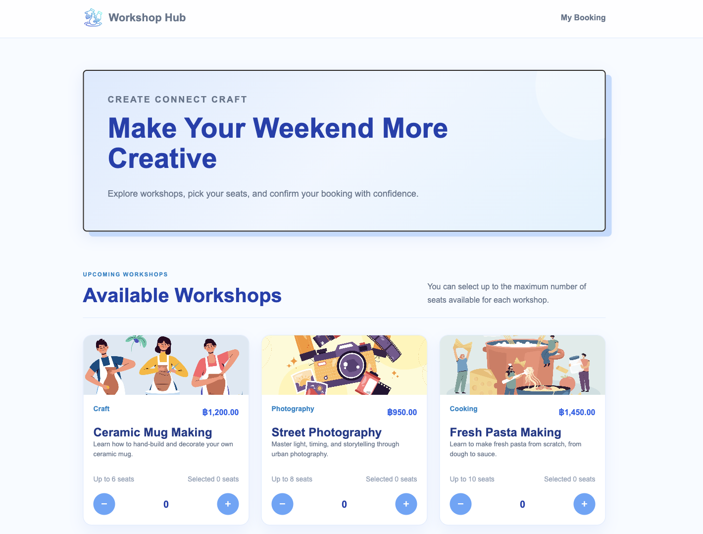
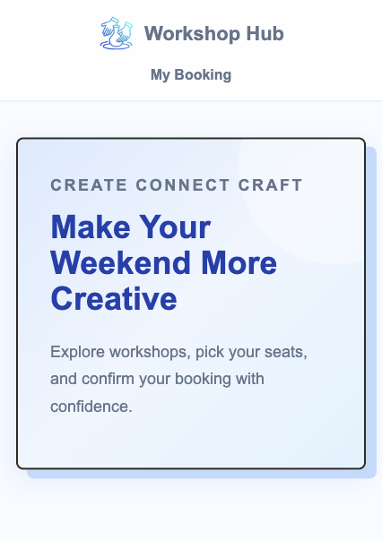
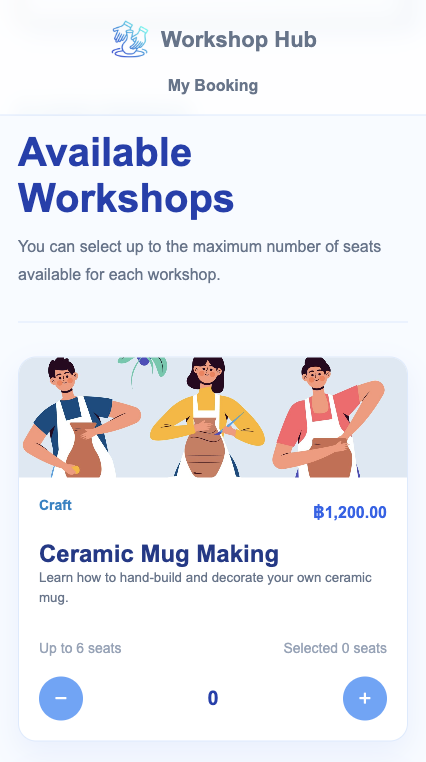

# 🎨 Workshop Hub

A responsive workshop booking web app built with **HTML, CSS, and Vanilla TypeScript** — no frameworks, no backend. Users can browse workshops, pick seats, see live pricing, and confirm a booking, with their selections persisted across page reloads.

> 📚 This project started as a weekly assignment for the [Varislab Frontend Bootcamp](https://github.com/VaridenTech/varislab-frontend-bootcamp-content-7-july-2026/blob/main/Week_03/04_workshop_booking_assignment/README.md). I rebuilt it and extended it with additional features as a portfolio piece.

🔗 **Live demo:** [myportfolio-taki10.vercel.app](https://myportfolio-taki10.vercel.app/)
📦 **Repository:** [github.com/Toktakk/portfolio](https://github.com/Toktakk/portfolio)

## Screenshots

**Desktop**



**Mobile**

<p>
  
  
</p>

## Features

- Browse 6+ workshops with title, category, price, description, and seat capacity
- Increase/decrease seat selection per workshop, clamped between `0` and `maxSeats`
- **Remaining seats indicator** — shows how many seats are left per workshop, or "Fully Booked" when sold out
- Live-updating booking summary with **Subtotal**, **Service Fee (3%)**, and **Total**
- Form validation — requires a name and at least one selected seat before confirming
- Clear success/error feedback messages
- **Clear booking button** — resets all selections, the name field, and saved data in one click
- **Persisted selections with `localStorage`** — seat counts survive a page refresh
- Fully responsive layout (desktop, tablet, mobile)

## Tech Stack

- **TypeScript** (Vanilla — no framework)
- **HTML5 / CSS3** (custom layout, CSS Grid & Flexbox)
- **Vite** — build tool & dev server
- **Vercel** — deployment

## Getting Started

**Prerequisites:** Node.js `^20.19.0 || >=22.12.0`

```bash
git clone https://github.com/Toktakk/portfolio.git
cd portfolio
npm install
npm run dev
```

Build for production:

```bash
npm run build
```

## Project Structure

```
portfolio/
├── index.html
├── src/
│   ├── main.ts
│   └── style.css
├── public/
│   └── images/
├── package.json
└── tsconfig.json
```

## What I'd improve next

- Add a category filter so users can browse by workshop type
- Add a discount code field
- Extract workshop data into a JSON file to make the app more data-driven
- Remove leftover debug `console.log` calls before production use

## Credits

Assignment brief by [Varislab Frontend Bootcamp](https://github.com/VaridenTech/varislab-frontend-bootcamp-content-7-july-2026). Illustrations from [Freepik](https://www.freepik.com/). All code, styling, and structure written by me.
